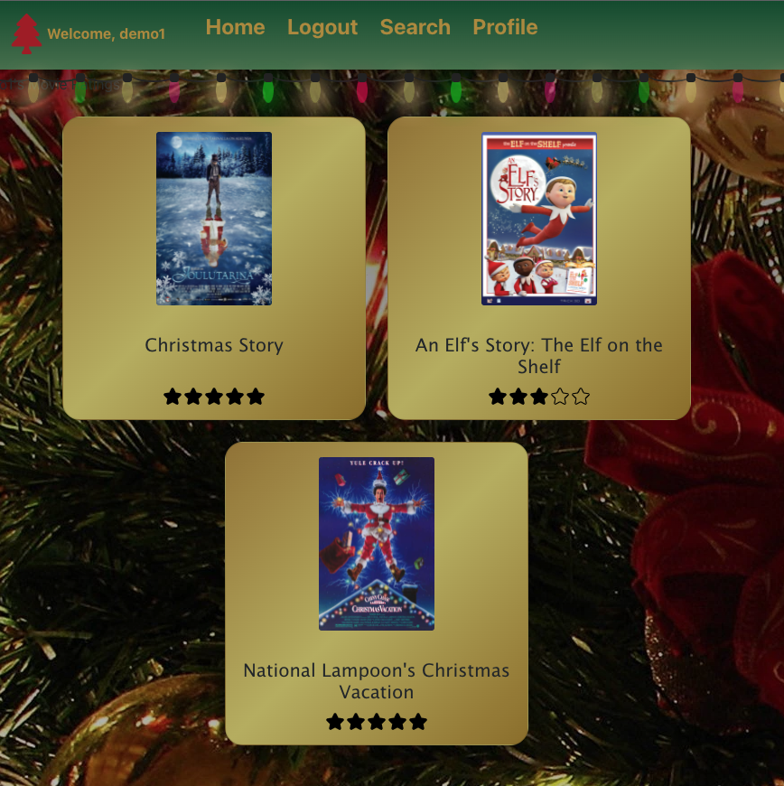

# project03

    Created by Ben Wofford, Cam Herbert, Kathleen Wine, Sean McCarthy, Steven Sosebee

The deployed application can be found [here](https://kmwine02-project03.herokuapp.com/).

A user friendly application for searching and rating Christmas movies.

- User can search for any Christmas movie.
- User can click on a card and view current dynamically loaded information.
- User can login/create account.
- User can add watched movies to a list, rate them and save that information to their account.

## Table of Contents

- [Technology](#Technology)
- [Features](#Features)
- [Screenshots](#Screenshots)
- [Repository Link](#Repository)
- [Questions](#Questions)

## Technology

1. bcrypt
2. GraphQL
3. Material UI
4. Express-handlebars
5. React Bootstrap

## Features

- User Accounts
- Seach Engine utilizing iMDB API
- Dynamically loaded information
- Saving watched movies and their rating

## Screenshots

Once logged in, a user can search for movies and rate them,

The user can save movies to their account along with a rating,

## Repository

- [Github](https://github.com/kmwine02/project03)

## Questions

For any questions regarding this project, please contact a member below:

- [Ben Wofford](https://github.com/benwofford)
- [Cam Herbert](https://github.com/caaam)
- [Kathleen Wine](https://github.com/kmwine02)
- [Sean McCarthy](https://github.com/McTastic)
- [Steven Sosobee](https://github.com/steven-sosebee)
